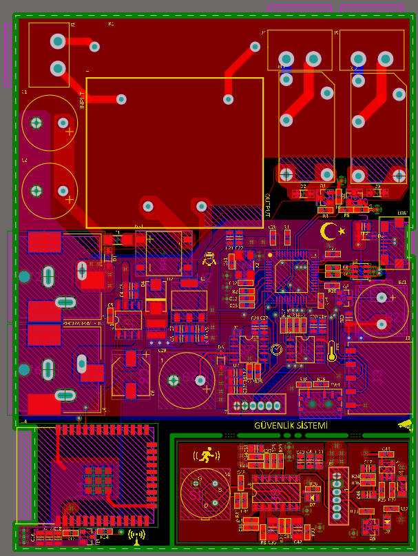

# Güvenlik Sistemi

Güvenlik Sistemi pcb kartı 19.09.2022 tarihinde linkteki [kurs](https://www.udemy.com/course/altium-designer-donanim-tasarim/) izlenerek tamamlanmıştır. 
Linkedln paylaşımıma [link](https://www.linkedin.com/feed/update/urn:li:activity:6979757020350435328/) üzerinden ulaşabilirsiniz.

- 220V AC ile çalışabilmektedir. 
- 12V DC , 5V DC ve 3.3V DC güç çıkışı bulunmaktadır.
- İşlemci olarak STM32F103C8T6 kullanılmaktadır.
- Bilgisayara bağlanabilir ve veri aktarabilir.
- Gerçek zamanlı saat bilgisi ile anlık ortam sıcaklık verisini kullanıcıya aktarabilmektedir.
- Hareket algılandığında kullanıcıya uyarı verebilmektedir.
- Wi-Fi ile internete bağlanablmektedir.
- Pcb kartı 4 katmanlıdır ve 75x100 mm boyutundadır.
- Kartın bir bölümü kırılabilir yapıdadır ve bu kısım işlemciye konnektör ile bağlantılıdır.
 
 

  
  
